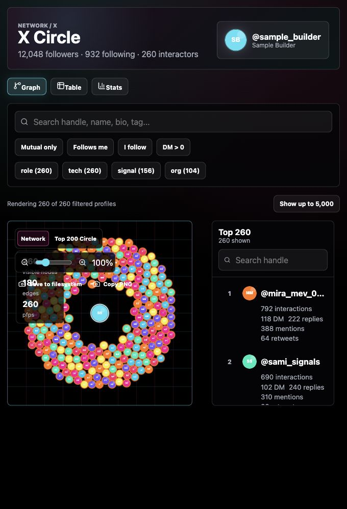

# X Circle

Turn your X archive into a private, local X network graph and a Top 200 circle screenshot.

This is a standalone extraction of the X Network graph from the local Obsidian Portal. It runs fully in the browser after you generate `public/generated/x-network.json` from your own X archive.



## Features

- Force-style X interaction graph with small avatar nodes.
- Top 200 circle view with your profile centered.
- Save-to-filesystem PNG export.
- Copy-to-clipboard PNG export.
- Searchable right rail with ranks, DM/reply/mention/retweet stats.
- Virtualized interaction table and basic stats view.
- Sample data fallback so the app works before you import an archive.

## Quick Start

```bash
bun install
bun run dev
```

Open the Vite URL and you should see the sample X Circle.

## Back Up Your X Archive

X's current archive flow is:

1. On x.com, open **More** in the left navigation.
2. Go to **Settings and privacy**.
3. Choose **Your account**.
4. Select **Download an archive of your data**.
5. Confirm your password or verification code.
6. Click **Request archive**.
7. Wait for X to email or notify you that the archive is ready.
8. Download the `.zip` while logged into the same X account.
9. Save the original `.zip` somewhere durable before extracting it.

Recommended local layout:

```bash
mkdir -p ~/Documents/exports/X
ARCHIVE_DATE=$(date +%Y-%m-%d)
mv ~/Downloads/twitter-*.zip ~/Documents/exports/X/x-archive-$ARCHIVE_DATE.zip
ditto -x -k ~/Documents/exports/X/x-archive-$ARCHIVE_DATE.zip ~/Documents/exports/X/archive
```

After extraction, you should have a data folder with files like:

```txt
~/Documents/exports/X/archive/data/account.js
~/Documents/exports/X/archive/data/tweets.js
~/Documents/exports/X/archive/data/follower.js
~/Documents/exports/X/archive/data/following.js
~/Documents/exports/X/archive/data/direct-messages.js
```

X says archive preparation can take a few days, and the archive includes machine-readable HTML and JSON-style files for posts, DMs, followers, following, profile data, media, address book data, ads data, and more. See X's official docs: [download your X archive](https://help.x.com/en/managing-your-account/how-to-download-your-x-archive) and [access your X data](https://help.x.com/en/managing-your-account/accessing-your-x-data).

## Extract Graph Data

Run the included extraction script against your archive `data/` directory:

```bash
bun run import:archive -- --archive-dir ~/Documents/exports/X/archive/data
```

This writes:

- `public/generated/x-network.json`, used by the app.
- `data/x-network/interactions.jsonl`, the normalized interaction table.
- `data/x-network/followers.jsonl`, a normalized followers table.
- `data/x-network/following.jsonl`, a normalized following table.
- `data/x-network/top-interactions.md`, a readable top-200 summary.

Generated data is ignored by Git.

The interaction table is JSONL: one person per line, with fields like:

```json
{
  "userId": "123",
  "handle": "alice",
  "dm_total": 12,
  "dm_sent": 7,
  "dm_received": 5,
  "mentions_sent": 40,
  "replies_sent": 9,
  "retweets_sent": 3,
  "interaction_score": 130
}
```

The graph JSON is derived from that table and follows the TypeScript model in `src/types.ts`.

### Script Options

```bash
python3 scripts/build-x-network.py \
  --archive-dir ~/Documents/exports/X/archive/data \
  --out public/generated/x-network.json \
  --normalized-dir data/x-network
```

Optional flags:

- `--tagged-following path/to/tagged.jsonl`: merge handle metadata such as `name`, `bio`, `verified`, and `tags`.
- `--me-id 123456`: override your account id if `account.js` is missing or malformed.

## Optional Profile Images

The archive does not include profile images for everyone. You can optionally fetch public X profile images for the top handles:

```bash
bun run fetch:avatars
```

Useful environment variables:

```bash
X_AVATAR_LIMIT=200 bun run fetch:avatars
X_AVATAR_HANDLES=alice,bob,charlie bun run fetch:avatars
X_AVATAR_CONCURRENCY=3 bun run fetch:avatars
```

Fetched avatars are saved under `public/generated/x-avatars/` and the generated JSON is updated with local avatar URLs.

## Data Model

The app expects:

```ts
interface XNetwork {
  account?: XNetworkAccount;
  counts?: Record<string, number>;
  nodes: XNetworkNode[];
  edges: XNetworkEdge[];
  followersOnlyIds: string[];
  followingOnlyIds: string[];
  dmMonthly: XNetworkDmMonthly[];
}
```

Interaction score is:

```txt
DM * 5 + reply * 3 + mention + retweet + groupDM * 0.5
```

## Privacy

All imported archive data stays local. Do not commit `public/generated/` or `data/x-network/` if it contains your private network. The app works from local files and does not need a server-side database.

## Repository Status

This repository is designed to be public and ships with sample data only. Keep private archive exports out of Git.
